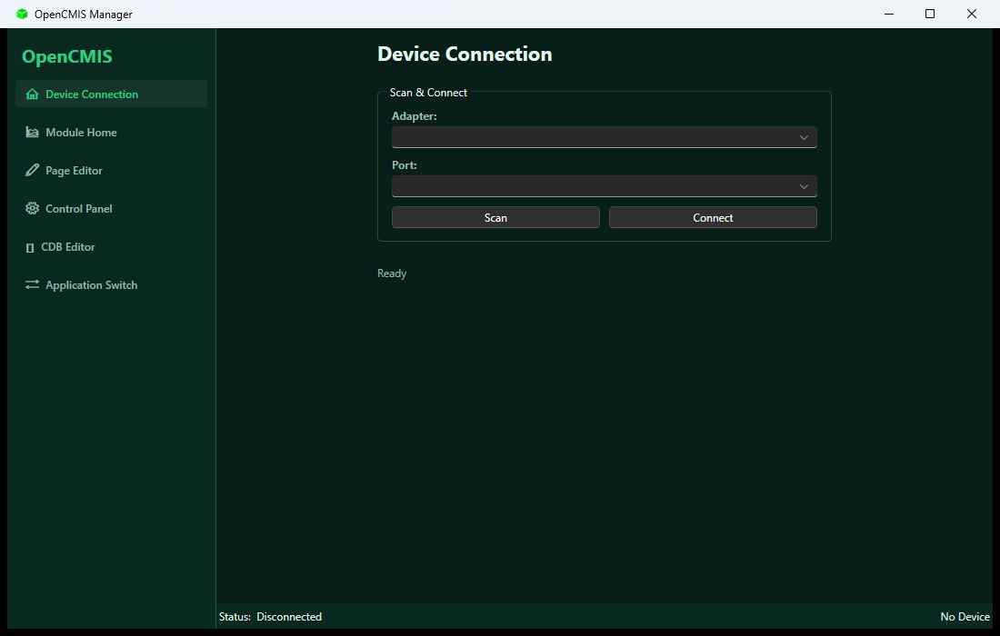
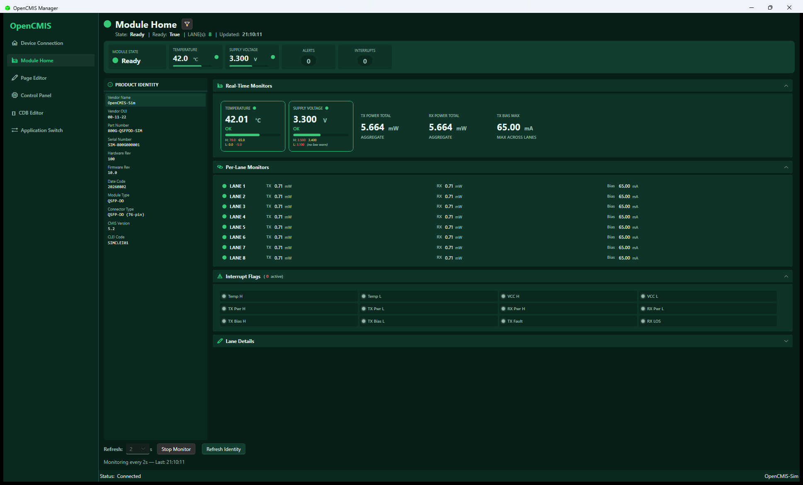
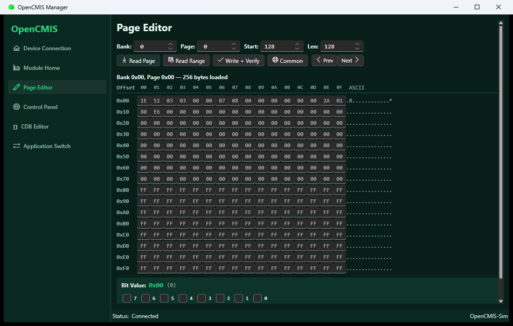
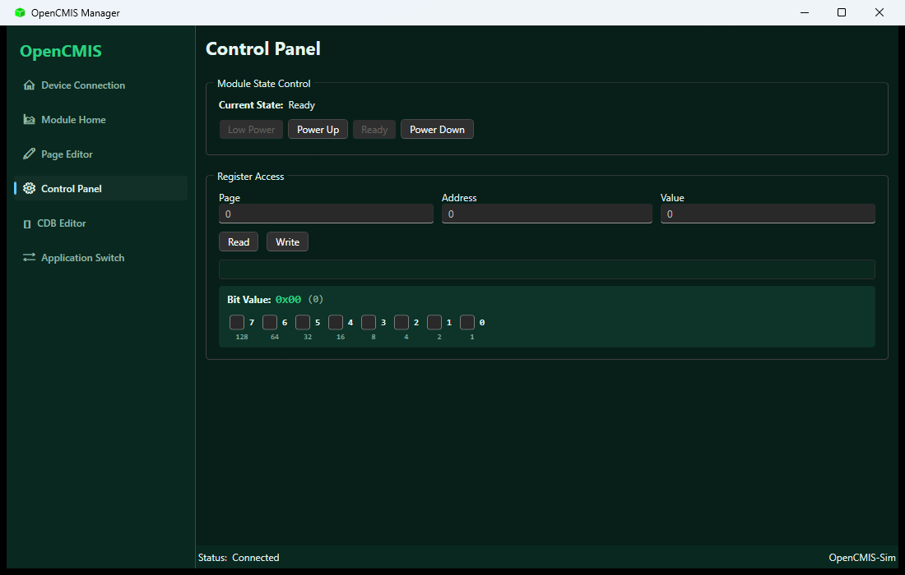
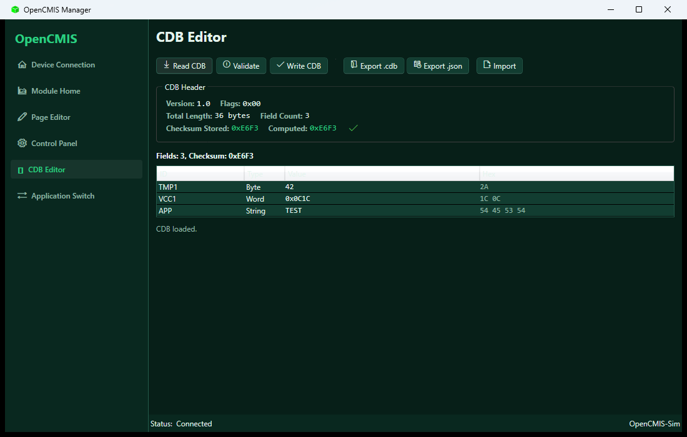
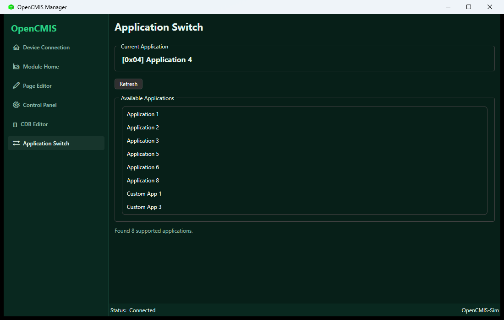

# OpenCMIS GUI 使用指南

OpenCMIS Manager（`OpenCMIS.UI.WPF`）是 Windows 桌面应用，提供 CMIS 5.2/5.3 光模块的图形化监控与管理能力。支持**串口桥**、**Cypress USB** 与**内置模拟器**三种连接方式，无真实硬件也可完整体验全部功能。

## 启动方式

环境要求：Windows + .NET 10 SDK。

```powershell
dotnet run --project src/OpenCMIS.UI.WPF
```

或构建后直接运行：

```powershell
dotnet build src/OpenCMIS.UI.WPF/OpenCMIS.UI.WPF.csproj
.\src\OpenCMIS.UI.WPF\bin\Debug\net10.0-windows\OpenCMIS.UI.WPF.exe
```

### 无真实硬件？使用模拟设备

1. 启动应用后进入 **Device Connection** 页
2. 点击 **Scan**，Adapter 下拉选择 **`sim`**
3. Port 下拉选择模拟模块（如 **"Simulated 800G CMIS Module (5.2)"**，另有 5.3 与 1.6T 变体）
4. 点击 **Connect**，即可连接内置模拟器（默认填充了完整的 CMIS 身份、监控、CDB 与应用数据）

## 主窗口布局

- **左侧边栏**：应用 Logo 与六个功能页导航（Accordion）：Device Connection → Module Home → Page Editor → Control Panel → CDB Editor → Application Switch
- **内容区**：当前页面
- **底部状态栏**：连接状态（`Status: Connected`）与设备名（如 `OpenCMIS-Sim`）

应用默认使用 **深色主题**（Win11 Dark），日志写入 `logs/cmis-wpf-<日期>.log`（滚动按天）。

## 页面详解

### 1. Device Connection — 设备连接



- **Scan & Connect** 区域：Adapter 下拉（`linktel` / `hm` / `hm-multichannel` / `cypress` / `sim`）、Port 下拉（扫描到的串口或模拟模块）、**Scan** / **Connect** / **Disconnect** 按钮
- 连接成功后显示 **Device Info** 面板：Vendor、Part Number、Serial Number
- 状态文本显示扫描与连接结果

### 2. Module Home — 模块监控主页



连接后自动加载，主要区域：

- **摘要仪表盘**：模块状态 LED（`MODULE STATE`）、温度（`TEMPERATURE`，带阈值条）、供电电压（`SUPPLY VOLTAGE`）、`ALERTS` 与 `INTERRUPTS` 计数徽章
- **Real-Time Monitors**：温度、供电电压、TX/RX 总功率（AGGREGATE）、TX 偏置最大值，每张卡片显示当前值、告警/警告阈值范围与状态色
- **Per-Lane Monitors**：每个 Lane 的 TX 功率、RX 功率、TX Bias 与 LOS 标志，Lane 状态 LED
- **Interrupt Flags**：中断标志芯片网格，活动中断高亮
- **Lane Details**：可折叠的详细表格（TX/RX 功率、偏置、Enabled、LOS/LOL、Fault）
- **控制条**：Refresh 间隔（秒）、**Start Monitor** / **Stop Monitor**、**Refresh Identity**
- 左侧 **PRODUCT IDENTITY** 面板（可折叠）展示厂商/PN/SN/类型/版本等身份属性

### 3. Page Editor — 寄存器页编辑器



- 输入 **Bank / Page / Start / Len**（0–255）后点击 **Read Page** 读取一整页，或 **Read Range** 按指定长度读取
- 结果以十六进制视图展示：Offset 列 + 每字节可编辑的 Hex 输入框 + ASCII 列
- **Write + Verify**：将编辑后的数据写回并回读校验
- **Common**：快捷读取公共页；**Prev / Next** 在页面间翻页
- 选中字节后可编辑其 **Bit Editor** 位视图

### 4. Control Panel — 控制面板



- **Module State Control**：显示当前状态，一键切换 **Low Power** / **Power Up** / **Ready** / **Power Down**（非法状态转换自动禁用按钮）
- **Register Access**：Page / Address / Value 输入框，**Read** 读取单寄存器并显示结果，**Write** 写入寄存器
- 结果下方为 **Bit Editor**，可逐位查看与编辑寄存器值

### 5. CDB Editor — 配置数据块编辑器



- 工具栏：**Read CDB**（从模块读取）、**Validate**（结构 + CRC 校验）、**Write CDB**（写回并刷新校验和）、**Export .cdb** / **Export .json**、**Import**
- **CDB Header**：Version（如 1.0）、Flags、Total Length、Field Count、Checksum Stored 与 Computed（CRC-16），校验结果以 ✓ / ✗ 图标显示
- **字段表格**：ID / Type（Byte / Word / DWord / String）/ Value（按类型显示十进制或 0x 十六进制）/ Hex（原始字节）；编辑字段值后自动重算校验和

### 6. Application Switch — 应用切换



- **Current Application**：当前激活的 CMIS Application（如 `[0x04] Application 4`）
- **Refresh**：重新读取当前应用与支持列表
- **Available Applications**：模块支持的应用列表（依据寄存器中的 supported mask），点击条目执行切换

## 常见问题

- **连接失败（MsaPageSelectionFailed / DeviceNotConnected）**：确认设备已上电且 I2C 地址正确；模拟器无需额外配置
- **CDB 读取报 CdbFormatError**：模块未填充有效 CDB 数据（模拟器已内置有效 CDB，可直接读取）
- **找不到串口**：点击 **Scan** 重新枚举；Cypress USB 需要 Windows 且已安装驱动

更多命令与脚本化操作见 [CLI 使用指南](cli-guide.md)。
